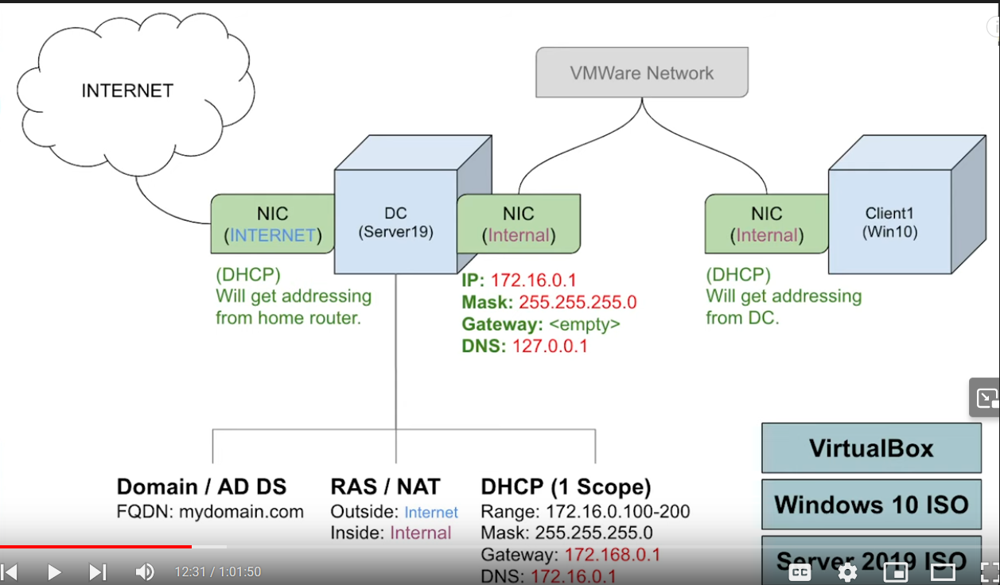

# ActiveDirectoryHomeLab
**Setting Up a Windows Server 2019 Domain Controller Lab with Active Directory, RAS, and DHCP**

The following information is a description of my process through a home lab fround on YouTube that works to give viewers hands on expereince with Active Directory, Windows Server 2019, Virtual Box, and configuring NAT, DHCP servers, IP addresses, and multiple hosts within a Windows domain. 

The lab video can be found at https://www.youtube.com/watch?v=MHsI8hJmggI&list=PL77p3MGFu_mSHCTDv4H6j5aspVNvxDH2x&index=1&t=926s from the YouTube creator Josh Madakor.

### Prerequisites:
- VirtualBox
- Windows 10 ISO
- Windows Server 2019 ISO

### Step 1: Configure Your Server 2019 Virtual Machine
- Set up a VM in VirtualBox with Windows Server 2019.
- Configure the VM to have two network adapters:
  - One connected to NAT for internet access.
  - Another connected to an internal network for local communication.
- After booting up the Server VM, configure the internal network with an IP address, subnet mask, and DNS address.

### Step 2: Set Up Active Directory Domain Services
- Install Active Directory Domain Services and create a new forest or domain.

### Step 3: Create an Administrator Account for the New Domain

### Step 4: Install Remote Access Service (RAS) and Enable NAT
- Install RAS to allow remote connections to network resources.
- Enable NAT to facilitate internet access for clients on the internal network.

### Step 5: Set Up DHCP Server
- Configure a DHCP server on the domain controller.
- Define a scope of IP addresses for client assignment.

### Step 6: Execute PowerShell Script to Create Windows Users
- Use a PowerShell script to generate Windows user accounts for the domain.

### Step 7: Create a Windows 10 Client Virtual Machine
- Set up a client VM with Windows 10, connecting it to the same internal network as the Windows Server.
- Test internet connectivity, NAT, and DHCP functionality using commands like `ipconfig` and `ping`.

### Step 8: Join the Client to the Domain
- Rename the client device and join it to the domain.

### Step 9: Conclusion
- Your client VM now functions as a device on the newly created network.
- Users can sign in to any of the accounts created by the script.

---
